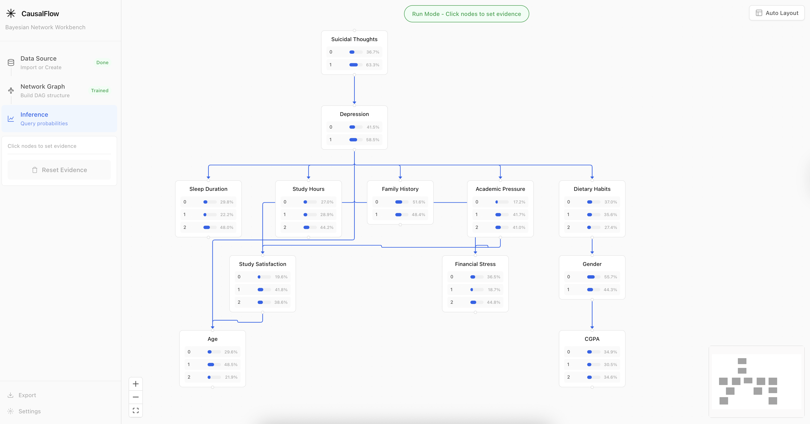
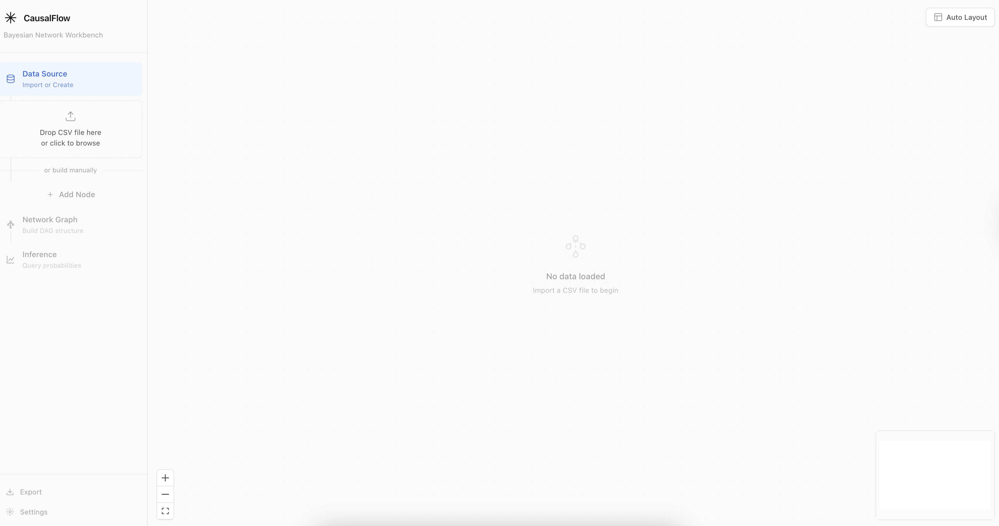
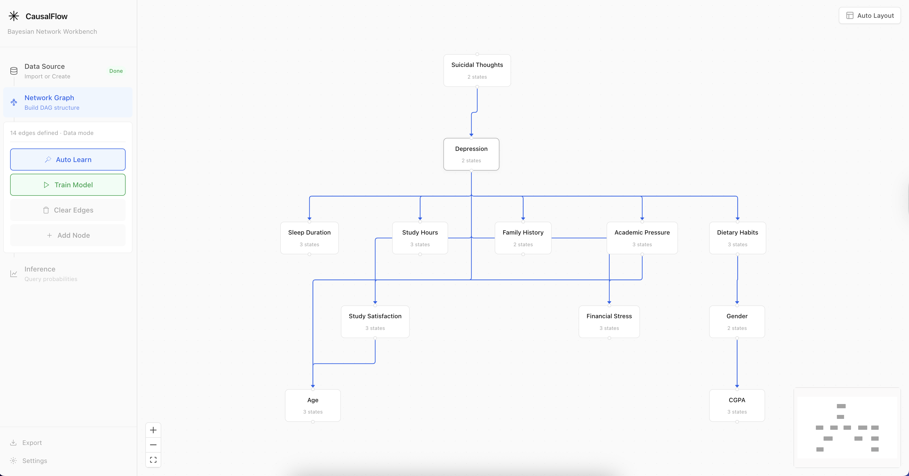

<p align="center">
  
</p>

<h1 align="center">CausalFlow</h1>

<p align="center">
  <strong>The open-source, visual-first Bayesian Network workbench.</strong><br/>
  Build causal models from data or expert knowledge, run real-time inference, and understand <em>why</em> things happen — all in your browser.
</p>

<p align="center">
  <a href="#-quick-start">Quick Start</a> ·
  <a href="#-features">Features</a> ·
  <a href="#-deploy-to-vercel">Deploy</a> ·
  <a href="#-contributing">Contributing</a>
</p>

<p align="center">
  
  
  
</p>

---

## Why CausalFlow?

Most Bayesian Network tools are either locked behind expensive GUIs, buried in Jupyter notebooks, or require you to write hundreds of lines of `pgmpy` boilerplate. **CausalFlow changes that.**

| Pain Point                                  | CausalFlow                                                                              |
| ------------------------------------------- | --------------------------------------------------------------------------------------- |
| "I need to install MATLAB / Netica / GeNIe" | **Runs in any browser** — zero install                                           |
| "I have to code everything in pgmpy"        | **Visual drag-and-drop** DAG editor                                               |
| "I can't mix domain knowledge with data"    | **Three workflow modes**: manual priors, data-driven, or hybrid                   |
| "Updating evidence is painfully slow"       | **Real-time inference** — click a node, watch every probability update instantly |
| "My graph looks like spaghetti"             | **Auto hierarchical layout** powered by Dagre                                     |

---

## ✨ Features

### 🖱️ Visual DAG Editor

Drag, connect, and reshape your causal graph on an infinite canvas powered by React Flow. Auto-layout keeps things readable as your network grows.

### 📊 Three Workflow Modes

- **Data → Structure → Train → Infer**
  Upload a CSV. Let Hill-Climbing discover the structure. Train CPTs via MLE. Done.
- **Manual Nodes + Priors → Build → Infer**
  No data? No problem. Define nodes, set prior probabilities, draw edges, and run inference purely from expert knowledge.
- **Hybrid: Data + Manual Nodes**
  Combine the best of both — let the algorithm learn from data, then layer in domain expertise.

### ⚡ Real-Time Inference

Click any node to set evidence and watch posterior distributions propagate across the entire network in real time. Powered by Variable Elimination (exact inference).

### 🧠 Smart Data Ingestion

Drop a CSV and CausalFlow automatically validates discrete variables, extracts state spaces, and builds your initial node set — no data wrangling required.

### 🎨 Clean, Focused UI

Inspired by Linear. No clutter, no chrome — just your causal model front and center. Dark-free, distraction-free.

---

## 🏗️ Architecture

```
┌──────────────────────────────────────────────────┐
│                    Frontend                       │
│  React 19 · React Flow · Zustand · Tailwind CSS  │
│  Dagre (auto-layout) · Recharts                  │
├──────────────────────────────────────────────────┤
│                     REST API                      │
├──────────────────────────────────────────────────┤
│                    Backend                        │
│  FastAPI · pgmpy · NetworkX · Pandas             │
│  Variable Elimination · Hill-Climbing            │
└──────────────────────────────────────────────────┘
```

---

## 🚀 Quick Start

### Prerequisites

- **Node.js** ≥ 18
- **Python** ≥ 3.10
- **pip** (or **conda**)

### 1. Clone

```bash
git clone https://github.com/shuqiwhat/causal-flow.git
cd causal-flow
```

### 2. Backend

```bash
cd backend
python -m venv venv
source venv/bin/activate   # Windows: venv\Scripts\activate
pip install -r requirements.txt
uvicorn main:app --reload
```

The API will be available at `http://localhost:8000`. Swagger docs at `/docs`.

### 3. Frontend

```bash
cd frontend
npm install
npm run dev
```

Open `http://localhost:5173` and start modeling.

---

## 🎮 Usage

### Mode 1: Data-Driven

1. **Data Source** → Drop your CSV file
2. **Network Graph** → Click "Auto Learn" to discover structure
3. **Network Graph** → Click "Train Model" to fit parameters
4. **Inference** → Click any node to set evidence

### Mode 2: Expert Knowledge (Prior-Only)

1. **Data Source** → Click "Add Node", define states & prior probabilities
2. Repeat for all variables
3. **Network Graph** → Draw edges by dragging between node handles
4. **Network Graph** → Click "Build & Infer"
5. **Inference** → Set evidence, observe posterior updates

### Mode 3: Hybrid

1. Upload CSV **and** add manual nodes with priors
2. Use "Auto Learn" or draw edges manually
3. Choose "Train Model" (data-driven) or "Build from Priors" (expert)

---

## 📸 Screenshots

<table>
  <tr>
    <td align="center"><strong>Initial View</strong></td>
    <td align="center"><strong>DAG Construction</strong></td>
  </tr>
  <tr>
    <td></td>
    <td></td>
  </tr>
  <tr>
    <td align="center"><strong>Real-Time Inference</strong></td>
    <td align="center"><strong>Evidence Propagation</strong></td>
  </tr>
  <tr>
    <td></td>
    <td></td>
  </tr>
</table>

---

## 🌐 Deploy

> CausalFlow is a full-stack app (React frontend + FastAPI backend). Vercel can host the frontend; the backend needs a separate service.

See the [Deployment Guide](#deployment-options) below for full instructions.

### Docker Compose (Self-Hosted)

```bash
docker compose up --build
```

---

## 🤝 Contributing

Contributions are what make the open-source community awesome. Any contribution you make is **greatly appreciated**.

1. Fork the Project
2. Create your Feature Branch (`git checkout -b feature/amazing-feature`)
3. Commit your Changes (`git commit -m 'Add amazing feature'`)
4. Push to the Branch (`git push origin feature/amazing-feature`)
5. Open a Pull Request

See [CONTRIBUTING.md](CONTRIBUTING.md) for detailed guidelines.

---

## 📄 License

Distributed under the MIT License. See [LICENSE](LICENSE) for more information.

---

## ⭐ Star History

<a href="https://star-history.com/#shuqiwhat/causal-flow&Date">
 <picture>
   <source media="(prefers-color-scheme: dark)" srcset="https://api.star-history.com/svg?repos=shuqiwhat/causal-flow&type=Date&theme=dark" />
   <source media="(prefers-color-scheme: light)" srcset="https://api.star-history.com/svg?repos=shuqiwhat/causal-flow&type=Date" />
   
 </picture>
</a>

---

<p align="center">
  Built with ❤️ by <a href="https://github.com/shuqiwhat">Shuqi</a>
</p>
